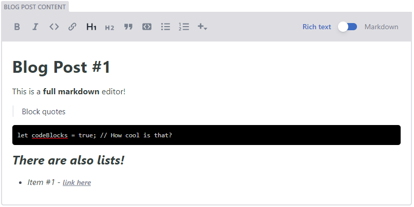

The markdown widget provides a full fledged text editor allowing users to format text with features such as headings and blockquotes. Users can change their editing view with a handy toggle button.

_Please note:_ If you want to use your markdown editor to fill a markdown file contents after its frontmatter, you'll have to name the field `body` so the CMS recognizes it and saves the file accordingly.

- **Name:** `markdown`
- **UI:** full text editor
- **Data type:** markdown
- **Options:**

  - `default`: accepts markdown content
  - `minimal`: accepts a boolean value, `false` by default. Sets the widget height to minimum possible.
  - `buttons`: an array of strings representing the formatting buttons to display (all shown by default). Buttons include: `bold`, `italic`, `code`, `link`, `heading-one`, `heading-two`, `heading-three`, `heading-four`, `heading-five`, `heading-six`, `quote`, `bulleted-list`, and `numbered-list`.
  - `editor_components`: an array of strings representing the names of editor components to display (all shown by default). Decap CMS includes `image` and `code-block` editor components by default, and custom components may be [created and registered](/docs/custom-widgets/#registereditorcomponent).
  - `modes`: an array of strings representing the names of allowed editor modes. Possible modes are `raw` and `rich_text`. A toggle button appears in the toolbar when more than one mode is available.
  - `sanitize_preview`: accepts a boolean value, `false` by default. Sanitizes markdown preview to prevent XSS attacks - might alter the preview content.

- **Example:**

  ```yaml
  - { label: "Blog post content", name: "body", widget: "markdown" }
  ```

This would render as:



_Please note:_ The markdown widget outputs a raw markdown string. Your static site generator may or may not render the markdown to HTML automatically. Consult with your static site generator's documentation for more information about rendering markdown.

### Remark plugins

You can register plugins to customize [`remark`](https://github.com/remarkjs/remark), the library used by the richtext editor for serializing and deserializing markdown.

```js
// register a plugin
CMS.registerRemarkPlugin(plugin);

// provide global settings to all plugins, e.g. for customizing `remark-stringify`
CMS.registerRemarkPlugin({ settings: { bullet: "-" } });
```

Note that `netlify-widget-markdown` currently uses `remark@10`, so you should check a plugin's compatibility first.
